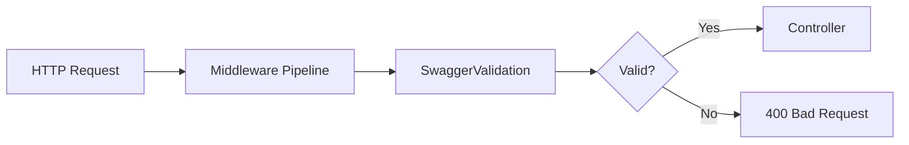
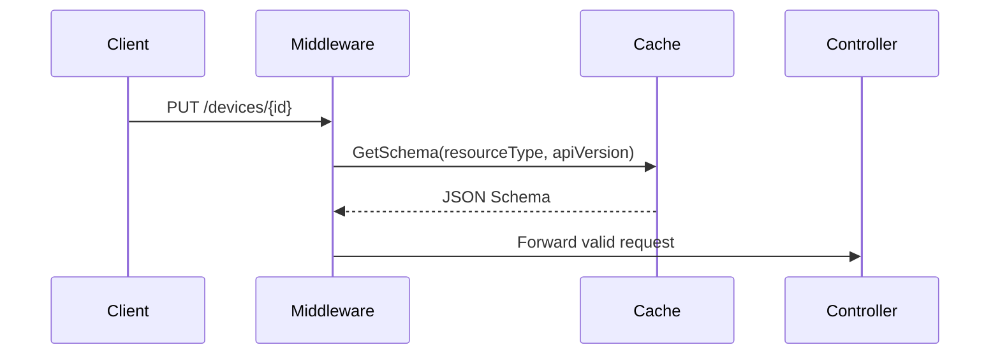
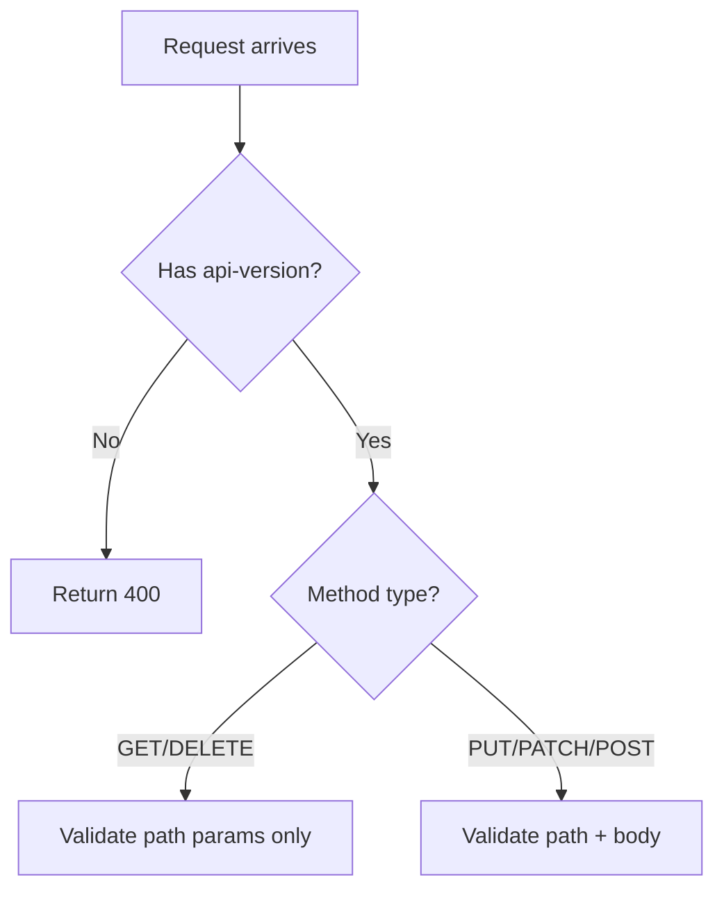
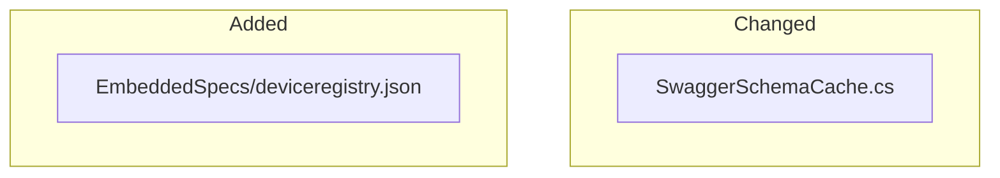

Review an Azure DevOps pull request: understand the changes, examine code quality, and provide feedback.

## When to Use

- User wants to understand what a PR does
- User wants to review someone's code and provide feedback
- User says "review PR", "what does this PR do", "review this code", etc.
- **NOT** for fixing code based on reviewer feedback — use the `pr-address` skill for that
- **NOT** for creating ADO work items — use the `pr-work-items` skill for that

## CRITICAL: Always Review the PR Branch Code

**⚠️ NEVER review files from the local workspace without verifying they match the PR branch.**
The local workspace may be on a different branch with stale or unrelated code. This leads to false findings.

**Always do one of these:**

1. **Fetch and read from the PR branch directly:**
   ```powershell
   git fetch origin <source-branch-name> 2>&1
   git --no-pager show FETCH_HEAD:<file-path>
   ```

2. **Or use `bluebird-code_history` with `method: "diff"`** to see the actual changes in each commit.

3. **List files on the PR branch** to find the correct paths (files may have moved):
   ```powershell
   git --no-pager ls-tree -r --name-only FETCH_HEAD | Select-String "<pattern>"
   ```

**Never assume file paths from commit diffs are still valid** — files may have been moved, renamed, or refactored in later commits. Always verify against the latest PR commit.

## Step-by-Step Process

### 1. Parse PR Input

Extract the PR ID from whatever the user provides:
- Full URL: `https://msazure.visualstudio.com/One/_git/Azure-IoT-Platform-DeviceRegistry/pullrequest/12345` → `12345`
- Short URL: `https://dev.azure.com/msazure/One/_git/Azure-IoT-Platform-DeviceRegistry/pullrequest/12345` → `12345`
- Just the number: `12345`

### 2. Fetch PR Data

Use the `bluebird-code_history` tool with `method: "pull_request"` and `pull_request_id: <PR_ID>` to get:
- PR title, description, author, status
- Reviewer votes (Approved / Waiting / Rejected)
- Linked work items
- Commit list

Also fetch comment threads via ADO API:

```powershell
$token = az account get-access-token --resource "499b84ac-1321-427f-aa17-267ca6975798" --query accessToken -o tsv 2>$null
$headers = @{ "Authorization" = "Bearer $token"; "Content-Type" = "application/json" }

$org = "msazure"
$project = "One"
$repo = "Azure-IoT-Platform-DeviceRegistry"
$prId = <PR_ID>

# Fetch comment threads
$threadsUrl = "https://$org.visualstudio.com/$project/_apis/git/repositories/$repo/pullRequests/$prId/threads?api-version=7.0"
$threads = Invoke-RestMethod -Uri $threadsUrl -Headers $headers -Method Get
```

### 3. Fetch the PR Branch

**Always fetch the PR source branch before reading any files:**

```powershell
# Get the source branch name from the PR metadata (e.g., "sgeislinger/validation-update")
git fetch origin <source-branch> 2>&1

# List all files to understand the actual structure
git --no-pager ls-tree -r --name-only FETCH_HEAD | Select-String "<relevant-pattern>"

# Read specific files from the PR branch
git --no-pager show FETCH_HEAD:<file-path>
```

This ensures you're reviewing the actual PR code, not stale local files.

### 4. Present PR Overview

Show the user:
- **Title, author, status, branch** (source → target)
- **Description** (first ~500 chars)
- **Reviewer status** (who approved, who's waiting)
- **Linked work items** (PBIs, bugs, tasks)
- **Commit summary** (count + key commit messages)
- **Existing comments** — count of human vs bot, active vs resolved

### 5. Examine the Changes

Use `bluebird-code_history` with `method: "diff"` and `commit_id` for key commits to understand what changed. Then **read the actual files from the PR branch** (via `git show FETCH_HEAD:<path>`) to see current state.

For each significant file change:

1. **Read the file from the PR branch** — NOT the local workspace
2. **Understand the context** — what does this code do, what patterns does it follow
3. **Check for issues** — bugs, security concerns, missing error handling, test gaps, naming inconsistencies, convention violations

Refer to the repo's conventions in `AGENTS.md` and `docs/guidelines/writing-code.md` when evaluating code quality.

### 6. Generate Review Document

Create a markdown document at `pr-<PR_ID>-review.md` in the **project root** so it's easy to find and share.

The document must include:

#### Header
```markdown
# PR Review — PR #<PR_ID>: "<PR Title>"
**Author:** <Author> | **Branch:** `<source>` → `<target>` | **Date:** <review date>
```

#### What This PR Does
A clear summary of the changes in your own words, based on the actual code (not just the PR description).

#### Mermaid Flow Diagrams

Use mermaid diagrams to visualize what the PR changes. Choose diagram types that best fit the changes:

**Architecture / Component changes** — show how components interact:
````markdown

````

**Data/request flow** — trace how data moves through the system:
````markdown

````

**State or decision logic** — show branching behavior:
````markdown

````

**File/module structure** — show what was added/changed/removed:
````markdown

````

Include at least one flow diagram showing the main architectural or data flow change in the PR.

#### Findings Table

```markdown
## Findings

| Severity | Finding | File | Line | Details |
|----------|---------|------|------|---------|
| 🔴 Bug | Description | exact/file/path.cs | 181 | Detailed explanation |
| 🟡 Suggestion | Description | exact/file/path.cs | 323 | Detailed explanation |
| 🟢 Nit | Description | exact/file/path.cs | 67 | Detailed explanation |
```

**Before adding any finding to the table, verify it against the actual PR branch code.** Read the relevant code via `git show FETCH_HEAD:<path>` and confirm the issue exists. Do not report findings based on assumptions or stale code.

#### Suggested PR Comments

For each finding, include a ready-to-post comment block with the exact file path and line number:

```markdown
## Suggested PR Comments

### Comment 1 — 🟡 Description
**File:** `/exact/path/to/file.cs`
**Line:** 181
**Comment:**
> Constructive description of the issue and suggested fix.
```

Each suggested comment must include:
- **Exact file path** (as it appears in the PR diff, starting with `/`)
- **Line number** (the specific line in the new/right side of the diff)
- **Ready-to-post comment text** — written in a constructive reviewer tone

This lets the user copy-paste comments directly into the PR or approve them for automated posting.

#### What Looks Good
Highlight the positive aspects of the PR — good patterns, clean architecture, test coverage, etc.

#### Existing Reviewer Comments
Summarize active reviewer comments and whether they appear valid based on your review of the actual code.

---

After generating the document, present findings to the user in the terminal organized by severity (🔴 🟡 🟢) with a note that the full review doc was saved.

### 7. Post Comments (WITH USER APPROVAL ONLY)

**⚠️ NEVER post comments on the PR without explicit user approval.**

After presenting findings, ask the user which (if any) they want posted as PR comments. For each approved comment:

1. Show the exact text that will be posted
2. Wait for explicit confirmation
3. Post via ADO API:

```powershell
$headers = @{ "Authorization" = "Bearer $token"; "Content-Type" = "application/json" }

# Create a new comment thread on a specific file/line
$body = @{
    comments = @(@{ content = "<comment text>" })
    threadContext = @{
        filePath = "/path/to/file.cs"
        rightFileStart = @{ line = 42; offset = 1 }
        rightFileEnd = @{ line = 42; offset = 1 }
    }
    status = "active"
} | ConvertTo-Json -Depth 5

$url = "https://$org.visualstudio.com/$project/_apis/git/repositories/$repo/pullRequests/$prId/threads?api-version=7.0"
Invoke-RestMethod -Uri $url -Headers $headers -Method Post -Body $body
```

## Important Notes

- **NEVER post comments or replies on the PR without explicit user approval.** Always show exactly what will be posted and wait for confirmation.
- **ALWAYS read code from the PR branch** — never trust local workspace files to match the PR. Use `git fetch origin <branch>` then `git show FETCH_HEAD:<path>`.
- **Verify every finding** against the actual PR code before reporting. False positives from stale code undermine trust in the review.
- **Use `bluebird-code_history`** for PR metadata and diffs — it's faster than raw API calls.
- **Check repo conventions** — review against the project's coding standards in `AGENTS.md` and `docs/guidelines/`.
- **Focus on substance** — flag bugs, security issues, missing error handling, test gaps. Skip style/formatting nits unless they violate `.editorconfig` rules.
- **Strip HTML from bot comments** — PR Assistant comments are HTML; use `-replace '<[^>]+>', ' '` to get plain text.
- **Save the review doc at project root** as `pr-<PR_ID>-review.md` for easy access and sharing.
